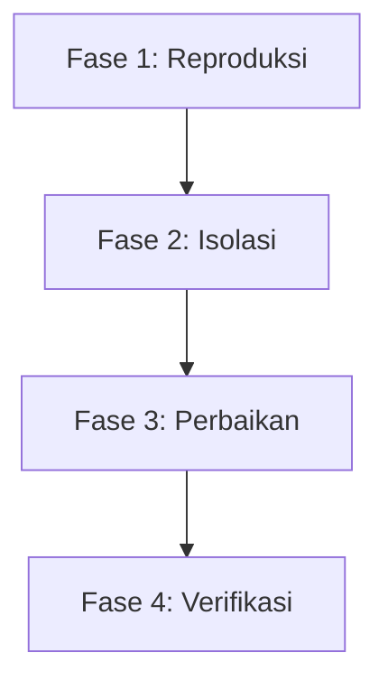

# Systematic Debugging Skill

Skill ini menetapkan protokol ketat bagi agen untuk menyelesaikan masalah (bug) yang dilaporkan dalam BendaharaApp. Semua langkah wajib diikuti secara berurutan untuk menghindari regresi fitur.

## Alur Kerja 4-Fase



---

### Fase 1: Reproduksi (Reproduction)

Tujuan fase ini adalah membuktikan adanya bug dengan cara yang terisolasi sebelum memodifikasi kode utama.

1.  **Analisis Laporan**: Pahami input, ekspektasi output, dan output aktual yang terjadi.
2.  **Tulis Test Case**:
    *   Buat berkas tes unit baru di `src/test/` (misalnya `src/test/bug_repro.test.js`) atau tambahkan test case ke dalam file test yang sudah ada.
    *   Gunakan data mock yang minimal tetapi representatif.
3.  **Jalankan Uji Coba**:
    *   Jalankan Vitest khusus untuk tes tersebut: `npx vitest run src/test/nama_test.test.js`.
    *   **Hasil Harus Gagal (FAIL)**: Jika tes langsung lulus, berarti reproduksi belum akurat atau bug tidak terpicu dengan kondisi tersebut.

---

### Fase 2: Isolasi (Isolation)

Tujuan fase ini adalah menemukan akar penyebab (*root cause*) kegagalan secara logis.

1.  **Periksa IPC Bridge (Electron)**:
    *   BendaharaApp menggunakan Electron IPC untuk berkomunikasi dengan database/sistem file. Cek handler di [main.js](file:///d:/AI%20SPACE/PROJECT/APPBENDAHARA/electron/main.js).
    *   Pastikan response IPC selalu mengembalikan format `{ success: true, data }` atau `{ success: false, error }`.
2.  **Verifikasi Zustand Store**:
    *   Periksa state management di `src/store/` (misalnya `useStore.js` atau slice spesifik).
    *   Pastikan mutasi state bersifat *immutable* dan memicu re-render dengan benar.
3.  **Audit Skema Database (Supabase)**:
    *   Bandingkan data yang dikirim dengan definisi tabel di [01_schema.sql](file:///d:/AI%20SPACE/PROJECT/APPBENDAHARA/01_schema.sql) atau file migrasi terkait.
    *   Perhatikan kesesuaian tipe data dan constraint.

---

### Fase 3: Perbaikan (Fixing)

Tujuan fase ini adalah menerapkan solusi yang elegan dengan dampak minimal pada bagian kode lainnya.

1.  **Prinsip Minimalis**: Buat perubahan sesedikit mungkin yang diperlukan untuk meloloskan test case reproduksi.
2.  **Pertahankan Tipe & Kontrak**: Jangan mengubah kontrak API atau skema database kecuali benar-benar diperlukan dan telah disetujui.
3.  **Dokumentasi Kode**: Tambahkan komentar singkat pada kode yang diperbaiki untuk menjelaskan *mengapa* perubahan tersebut dilakukan (bukan hanya *apa* yang diubah).

---

### Fase 4: Verifikasi (Verification)

Tujuan fase ini adalah memastikan bug telah teratasi sepenuhnya dan tidak menimbulkan masalah baru.

1.  **Jalankan Tes Reproduksi**:
    *   Pastikan test case reproduksi yang dibuat pada Fase 1 kini berstatus **PASS**.
2.  **Jalankan Regression Testing**:
    *   Jalankan seluruh test suite proyek:
        ```bash
        npm run test
        ```
    *   **Semua test harus 100% PASS**.
3.  **Dokumentasikan Hasil**:
    *   Catat temuan bug dan cara penanganannya ke dalam `PROGRESS.md`.
